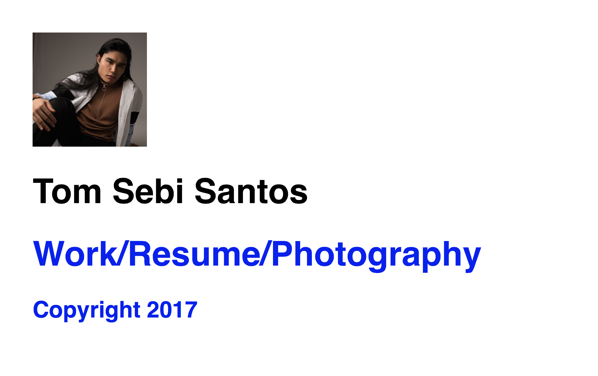

### Technologies:
- HTML
- CSS
- JavaScript


# Tom's About Me Project

### Code Sample:
##### Some HTML:
```
<!doctype html>
<html>
<head>
<meta charset="UTF-8">
<title>Tom Sebi Santos</title>
<meta name="" content="software developer/entrepreneur">

<link href="css/style.css" rel="stylesheet" type="text/css">
</head>
  <container>
    <body id="bgcolor">
      <div id="home">
      
      <h1>Tom Sebi Santos</h1>
      <h1 class = item id="a"><a href="#">Work/<a href="#">Resume/<a href="#">Photography</h1>
      </div>
    <footer id="contact">
      <h3 class = item><a href="#">Copyright 2017</h3>
    </footer>
      <script type="text/javascript" src="js/main.js"></script>
    </body>
  </container>
</html>
```
###### NOTE: This is an early work in progress
###### A completed page will be more dynamic, minimally designed, have multiple pages (or scrolling single page) and have more advanced functionalities/images.

## Author: Tom Santos
